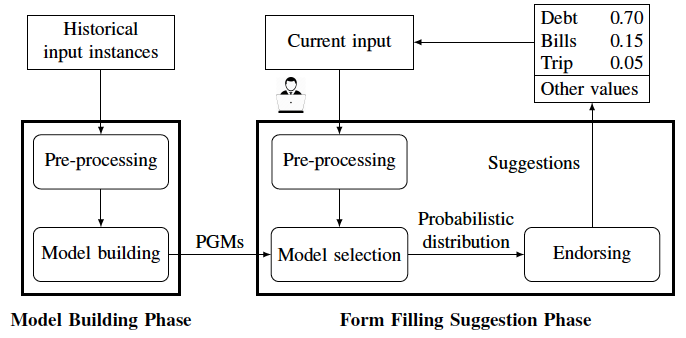

## Form_filling_replication
In this replication package, we make available the different scripts needed to fully replicate the results obtained in our paper:

- <a href="https://orbilu.uni.lu/handle/10993/50909"> A Machine Learning Approach for Automated Filling of Categorical Fields in Data Entry Forms </a> <br/>
<i>Hichem Belgacem, Xiaochen Li, Domenico Bianculli, Lionel Briand<br/>
ACM Transactions on Software Engineering and Methodology (TOSEM) 2022 <br/>
DOI: 10.1145/3533021
</i>

This is a mirror of the Figshare entry: https://figshare.com/articles/software/LAFF-replication-package/14866167

## Learning-based Automated Form Filling "LAFF"

LAFF is a learning-based automated approach for filling categorical fields in data entry forms.
LAFF includes two phases, "model building" and "form filling suggestion": 
- Model building phase:  LAFF analyses historical input instances of a data entry form and uses dependency analysis to build BNs that represent the fields in the form and their conditional dependency relationships. This phase occurs offline, before deploying LAFF as an assistive technology for data entry.

- Form filling suggestion phase: during the data entry session, given a target field, LAFF selects a BN among those built in the model building phase and predicts possible values based on the values in the already-filled fields and their conditional dependencies; the predicted values (endorsed based on field dependencies and prediction confidence) are then provided to the end-user as a list of suggestions.

<div align="center">

</div>

## Licence
LAFF is licensed under the MIT license.

LAFF includes as separate element the following dataset that is not distributed under the MIT license: NCBI BioSample, published on the National Center for Biotechnology Information, U.S. National Library of Medicine’s website, at: https://www.ncbi.nlm.nih.gov/biosample/, distributed under the license set out at https://www.ncbi.nlm.nih.gov/home/about/policies/#data.

## Content description
- The ``laff-expr-rep-package`` folder:
	- ``laff-expr-rep-package/code``: this folder contains the implementation of our approach and of the existing algorithms. It contains:
		- Folders: 
			- ``algorithms``: contains the code of the different algorithms
			- ``tests``: contains the test suite
			- ``tools``: contains the code to pre-process the dataset, evaluation metrics, and other utilities
		- Files:
			- ``arm_main.py``: main file for ARM strategy
			- ``mfm_main.py``: main file for MFM strategy
			- ``laff_main.py``: main file for LAFF strategy
			- ``naive_main.py``: main file for NAIVE strategy
			- ``fls_main.py``: main file for FLS strategy
			- ``alg_execution.py``: file used to execute the algorithm chosen by the user
			- ``rq_effectiveness.py``: file to generate the results of rq1-2
			- ``rq_variant.py``: file to generate the results of rq3
			- ``rq_size_of_data.py``: file to generate the results of rq4
			- ``rq_number_filled_fields.py``: file to generate the results of rq5
			- ``statistical_tests.py``: file to run the statistical test between different algorithms
            - ``set_config.py``: file used to update the configuration file
			- ``config.json``: file used to configure different parameters needed to run the source code. Below, we list the explanation of these parameters.
				- ``dataset``:
			  		- ``root_path``: root path of the dataset 
			 		- ``train-test ``: path to the folder ``train-test`` which includes our outputs
					- ``raw``: path to the raw dataset
			  		- ``train-ratio`` and ``test_ratio``: the train and test ratios used for splitting the training set and the testing set
			 		- ``unique-ratio``: the ratio of accepted unique values of columns for the preprocessing step
			 		- ``empty-ratio``: the ratio of accepted empty values of columns for the preprocessing step
				- ``laff_param``: 
					- ``use_filter``: a Boolean flag (true if the user wants to activate the endorsing module)
					- ``filter_th``: the threshold used in the endorsing module
					- ``use_local``: a Boolean flag (true if the user wants to activate the local modelling module)
					- ``min_cls_num`` and ``max_cls_num``: minimum and maximum number of clusters for the elbow method
				- ``arm_param``: 
					- ``min_sup`` and ``min_conf``: the minimum support and minimum confidence of the association rule mining algorithm
					- ``numeric``: a Boolean flag (true if the user wants to extract rules from numeric values)
				- ``predict``: 
					- ``rounds``: number of samples to evaluate rq5
					- ``fill_type``: the type of filling (options: all (for rq1-rq2-rq3), partial (for rq4), sample (for rq5))
					- ``fill_order``: the order of filling (options: seq, rand)
					- ``recommend_ratio``: the number of recommended values (e.g., 0.05 means suggesting top 5% values from the candidate values)			
					- ``algorithm``:  the algorithm that the user wants to run (options: mfm, arm, laff)
				- ``eval``: parameters to generate the final results
				    - ``run_alg``: a Boolean flag (true if the user wants to run the prediction phase)
				    - ``run_eval``: a Boolean flag (true if the user wants to run the evaluation phase)
					- ``fill_types``: an array that lists the filling types to be considered 
		            - ``fill_orders``: an array that lists the filling orders to be considered 
					- ``algorithms``: an array that lists the algorithms to be considered (if "fill_types=[all], fill_orders=[seq, rand] algorithms=[laff, mfm, arm, naive, fls], then it generates a table that shows the results of laff, mfm, arm, naive and fls under both sequential filling and random filling scenarios on all the test sets.)
					
		
	- Files: 
		- ``makefile``: file used to run different scripts
		- ``rq1-2.sh``: script to get the results of RQ1 and RQ2
		- ``rq3.sh``: script to get the results of RQ3
		- ``rq4.sh``: script to get the results of RQ4
		- ``rq5.sh``: script to ge the results of RQ5
		- ``codepath.sh``: used to specify the path to the source code
		- `requirement.txt`: file listing all the python packages needed to run the experiments

- The ``dataset`` folder: this folder contains the NCBI dataset and the intermediate results for running different algorithms on the dataset
    - ``raw``: the NCBI dataset for experiments
    	- ``bio_human_version_1.0.xml.zip``: this file represents the subset of the original NCBI BioSample dataset that we used in our evaluation. The file was downloaded on 12th February 2020, from (https://ftp.ncbi.nih.gov/biosample/)
    	- ``synonyms.json``: this file represents words in different forms that have the same meaning (e.g: 'na', 'not applicable', 'not determined' and 'n/a)
    	- ``xml2csv.py``: the script to convert the ``bio_human_version_1.0.xml`` into a csv file, which is the input of LAFF. The script extracts elements in xml, merges synonyms, and selects the rows with more than half of the categorical fields are filled
	- ``train-test``: the intermediate results (the trained models, the experiment results, and the preprocessed dataset)
		- ``model``: the model trained by LAFF
		- ``results``: the detailed output of each algorithm (in the folder ``details``), the evaluation of a single setting (in the folder ``tmp``), and the comparison of different algorithms 
		- ``partial``: contains the different test sets generated to evaluate RQ4. Each test set represents testing input instances with a certain number of filled fields 
		- ``sample``: contains the preprocessed datasets for different samples of historical input instances used to evaluate RQ5


## Prerequisites

- Python3
- [jq](https://stedolan.github.io/jq/)


## Steps

1. To be able to run our tool you need to install the different python packages present in the file "requirements.txt ". 
```bash
cd laff-expr-rep-package
pip install -r requirements.txt
```
2. To be able to evaluate our tool, you need to unzip the file bio_human_version_1.0.xml.zip in the raw folder, and run the script xml2csv.py to convert the xml file to a csv dataset
```bash
cd dataset/raw
python xml2csv.py
```
3. To get the results of all research questions, you need to run the makefile 
```bash
cd laff-expr-rep-package
make 
```
4. If you want to run only a specific script, you can run it by typing Make and the specified script name (rq1-2, rq3, rq4, and rq5)
```bash
cd laff-expr-rep-package
make  rq1-2
```
## RQ description

- rq1-2: we assess the effectiveness (by measuring the MRR and PCR) and the performance (by measuring training and prediction time) of LAFF compared with existing algorithms
- rq3: we assess the impact of the two modules (local modelling and endorsing) on the effectiveness of LAFF
- rq4: we assess the impact of the number of filled fields on the effectiveness of LAFF
- rq5: we assess the impact of the size of the training set on the effectiveness of LAFF 

## Description of the process

- When we run the code, first it preprocesses the raw data, and then generates some pre-processed datasets and a folder ``train-test``, which includes: 
	- The training set (preprocessed training set which encodes the value of fields into IDs): ``ncbi-homo-sapien_train.csv``
	- The testing sets for sequential and random filling scenarios: ``ncbi-homo-sapiens-test_rand.csv`` and  ``ncbi-homo-sapiens-test_seq.csv``
	- The mapping value/id represent the mapping between the value of the fields and the corresponding id: ``ncbi-homo-sapiens_val_id.csv`` 
    - When we run LAFF, it trains models and saved the models in the folder ``train-test/model``
- After running the code, it generates the detailed results for each setting (eg. MFM random, LAFF random, etc) which is saved in the folder ``train-test/results/details``.
This file saves the details of the prediction on each testing instance. The csv contains the following columns: target (which represents the current target of the instance), truth (the true value of the target), ranked (the ranked list), remained (means if the suggestion will be shown to the user), train and predict (training and prediction time).
 
- The detailed results in ``train-test/details`` are then used to compute the overall effectiveness of each algorithm which is saved in the folder ``train-test/results/tmp``. Files in ``train-test/results/tmp`` save the evaluation on each experiment setting. The header of each file is the same as the table in the paper. 

- In the end, all the evaluation results in ``train-test/results/tmp`` for each research question will be combined to generate files in the results folder. These generated fields correspond to the final results for all the RQs that we show in our paper.

For the csv file ``rq1-2-effectivness-ncbi-homo-sapiens.csv``, we combine the final results for the different approaches (MFM, ARM, NAIVE, FLS and LAFF) for both random filling and sequential filling scenarios.

For the csv file ``rq3-variants-ncbi-homo-sapiens.csv``, we combine the different results for the variants of LAFF
 
For the csv files ``rq4-num-fields-ncbi-homo-sapiens_[type]_[metric]_results.csv`` (type=[laff, arm, mfm, outlier, mean], metric=[mrr, pcr]), we present the details (i.e., interquartile range, mean, outliers) to draw the boxplots for mfm, arm, and laff under different numbers of filled fields. 

For the csv files ``rq5-size-of-data-ncbi-homo-sapiens_laff_seq.csv`` and ``rq5-size-of-data-ncbi-homo-sapiens_laff_rand.csv``, we present the results of LAFF with different sizes of training sets.
